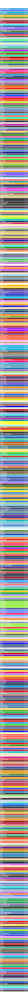

# Wakatime Colors

 [](https://github.com/abiriadev/wakatime-colors/actions/workflows/update.yaml)  

## Overview

A machine-readable list of programming languages along with their primary colors, as used in [Wakatime](https://wakatime.com/)

The data is updated automatically at regular intervals.

## Accessing the Data

You can directly fetch [the raw content from github](https://github.com/abiriadev/wakatime-colors/raw/main/colors.json) to get the latest data.

Alternatively, you can import this repository as an npm module and call the [`fetchJson()`](https://github.com/abiriadev/wakatime-colors/blob/main/src/index.ts#L3) function the retrieve the data from your JavaScript/TypeScript app.

### Docker support

You can run the fetcher as a docker container!

```sh
$ docker run --rm ghcr.io/abiriadev/wakatime-colors:main
```

It will immediately fetch and print the latest data to the standard output.

## Manually Build

To manually build the project, follow these steps:

```sh
# Checkout the repository
$ git https://github.com/abiriadev/wakatime-colors && cd wakatime-colors

# Install dependencies
$ corepack enable
$ pnpm install

# Build the source
$ pnpm build

# Finally, run below command to fetch and save data
$ pnpm run fetch
```

After running the above commands, the updated data will be available in `colors.json`.

### Rendering an SVG Preview Image

To generate an SVG preview image, assuming you have the `colors.json` file at the root:

```sh
$ go run .
```

This command will create a rendered SVG file named `colors.svg`.

## Preview



## License

[](./LICENSE)
